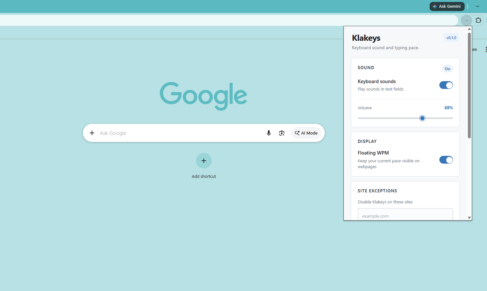

# Klakeys

Klakeys is a lightweight Chrome extension that adds subtle mechanical-keyboard
sounds as you type, along with an option to view live words per minute (WPM).

## Features

- Distinct sounds for regular keys, Space, Enter, and Backspace
- Adjustable volume and a quick on/off toggle
- Live WPM and completed word count for the current day
- Optional floating WPM counter that stays visible on webpages
- All settings and statistics are stored locally

---

## Screenshots



---

## File Structure

```text
klakeys
├── README.md
├── background.js
├── content.js
├── images
│   ├── icon128.png
│   ├── icon16.png
│   ├── icon32.png
│   └── icon48.png
├── manifest.json
├── popup.css
├── popup.html
├── popup.js
└── sounds
    ├── backspace.mp3
    ├── enter.mp3
    ├── key.mp3
    └── space.mp3
```

---

## Install locally

1. Open `chrome://extensions`.
2. Enable **Developer mode**.
3. Choose **Load unpacked** and select this folder.
4. Open a regular webpage and start typing in an input or text area.

Klakeys cannot run on Chrome's internal pages, the Chrome Web Store, or certain pages.

## Planned

- Custom sound packs and profiles
- Keystroke display
- Typing heatmap

---

Built for fun and learning. xD